# Sentinel CLI

Sentinel is a local, defensive research prototype for Foundry projects. It combines static and symbolic candidates with an isolated exploit, repair, and verification loop. It never deploys contracts, uses wallets, or sends transactions to a public network.

## Current implementation status

Slither and Mythril are connected to Scout with JSON parsing, candidate ranking, analyzer diagnostics and a persisted JSON ledger. Four deliberately vulnerable fixtures have executable proof-of-concepts, repairs, and Forge regression gates: reentrancy, missing access control, `tx.origin` authorization, and unchecked low-level calls. Every scan copies the project to an isolated temporary workspace, so Sentinel writes a patch diff without changing the source project.

General PoC generation, benchmark-scale evaluation, and distributed storage remain future work. Real analyzer candidates that do not match the four reviewed fixture templates stop for human review rather than receiving an unrelated patch.

See [Scout setup and limitations](docs/SCOUT_INTEGRATION.md), [implementation plan](docs/IMPLEMENTATION_PLAN.md), and [requirement matrix](docs/REQUIREMENT_TRACEABILITY.md).

## Architecture

```mermaid
flowchart LR
    A[Foundry project] --> B[Scout: Perceive]
    B --> C[Slither + Mythril + solc context]
    C --> D[Gemini 1.5 Flash candidate]
    D --> E[Red Team: GPT-4o PoC]
    E --> F[Forge exploit validation]
    F -->|confirmed| G[Blue Team: DeepSeek-Coder-7B via Ollama]
    G --> H[Minimal Invasive Change]
    H --> I[Judge: forge build]
    I --> J[Exploit defense]
    J --> K[Original regression tests]
    K -->|failure, max 5| G
    K -->|pass| L[Markdown audit report]
```



The cognitive flow is **Perceive -> Reason -> Act -> Observe**:

- **Scout** combines static evidence and semantic context. It produces candidates only.
- **Red Team** creates an executable Foundry test. A finding becomes confirmed only when Forge proves the exploit in the local EVM.
- **Blue Team** proposes a targeted patch under the Minimal Invasive Change constraint.
- **Judge** is deterministic and is never an LLM. It requires build success, exploit neutralization, and regression success.

## Model integrations

The project retains the MPP1 model assignments: Gemini for Scout, GPT-4o for future general PoC synthesis, and DeepSeek-Coder through Ollama for future repair synthesis. All three provider transports are implemented behind `LLMProvider`; missing credentials or unavailable local Ollama instances fail as recorded workflow evidence. The current validated repair path intentionally uses reviewed deterministic templates for the two supplied fixtures rather than an unbounded model-generated patch.

## Quick start

Python 3.11+ is required. For a real run, install Foundry, Slither, Mythril, and the optional model clients. Copy `.env.example` to `.env` and configure credentials only when needed.

```bash
python3 -m venv .venv
source .venv/bin/activate
pip install '.[dev,llm]'
sentinel scan ./examples/vulnerable_reentrancy --mock
sentinel scan ./examples/vulnerable_access_control --mock
sentinel scan ./examples/vulnerable_tx_origin --mock
sentinel scan ./examples/vulnerable_unchecked_call --mock
```

The command writes Markdown and JSON reports under `reports/`. `--mock` selects the deterministic Scout provider and enables clearly labeled fixture heuristics when external analyzers are unavailable; it does not fabricate Forge results. The original target source remains unchanged.

Read the report's **Pipeline Timeline** first. A candidate is only an initial signal; it becomes confirmed when the Red Team's Forge test proves the impact. A final `verified` result means the Judge built the patched copy, saw the exploit test fail, and saw all other tests pass. If the state is `execution_unavailable`, install Foundry and make `forge` available on your `PATH`; scanner errors likewise mean coverage is incomplete, not that the code is safe.

Use `--scout-only` for evidence collection without PoC or repair. Start the local dashboard and API with `make serve`, then open `http://127.0.0.1:8000`.

## Modern Solidity 0.8.x challenge corpus

`datasets/damn-vulnerable-defi` contains Damn Vulnerable DeFi, a Foundry-based corpus of realistic intentionally vulnerable DeFi challenges. Its source contracts use Solidity `0.8.25`, so install that compiler before running it:

```bash
solc-select install 0.8.25
solc-select use 0.8.25
# Confirm Foundry, Slither, and Mythril are installed and on PATH.
forge --version
slither --version
myth version
make test-damn-vulnerable-defi
make scan-damn-vulnerable-defi
```

`make test-damn-vulnerable-defi` compiles the corpus and is the health check for this repository integration. `make scan-damn-vulnerable-defi` runs Slither over the complete project and Mythril over one bounded source sample, then writes the Markdown report, raw ledger, and readable summary JSON under `reports/damn-vulnerable-defi/`. It can take about a minute; wait until the CLI prints `Audit report:` before looking for the files. The corpus's default challenge tests intentionally fail until each attack is solved; run them only with `make test-damn-vulnerable-defi-challenges` when you want to see that baseline:

```bash
make test-damn-vulnerable-defi-challenges
```

The make target creates the local compiler shim used by Foundry and Mythril from the compiler installed by `solc-select`; set `DVD_SOLC=/absolute/path/to/solc` if yours is elsewhere. Slither analyzes the project sources and excludes vendored `lib/` code from the audit report; Mythril symbolically analyzes the bounded source sample selected by `MYTHRIL_MAX_SOURCES` (default `10`). These are realistic multi-contract scenarios for detection and analysis; the four `examples/` projects remain the reviewed end-to-end PoC → patch → Judge demonstrations.

`--scout-only` is evidence collection only. It intentionally does **not** create `.patched.sol` or exploit-test files, because it does not enter Red Team, Blue Team, or Judge. Use one of the four supported end-to-end examples to produce a verified patch artifact:

```bash
make scan-reentrancy
make scan-access-control
make scan-tx-origin
make scan-unchecked-call
```

Use Google AI Studio to create a Gemini key, then add it to `.env` and select Gemini:

```bash
GOOGLE_API_KEY=your_key_here
LLM_PROVIDER=gemini
GEMINI_MODEL=gemini-2.5-flash
```

Then use the real-data agentic run to take the highest-ranked scanner candidate through Red Team, Blue Team, and Judge:

```bash
make run-damn-vulnerable-defi-agentic
```

This command uses the configured provider for PoC and patch drafts and Forge as the mandatory execution gate. It performs one bounded candidate attempt per run to control runtime and API quota. A patched Solidity artifact is saved only when the report outcome is `verified`; a failed PoC, unsafe diff, failed compilation, or failed regression remains an honest review result. Set `LLM_PROVIDER=openai` to use an API-funded OpenAI account, or `LLM_PROVIDER=ollama` to use a local Ollama model.

## Large-scale detection benchmark

FORGE Artifacts is the large-scale audit-derived corpus. Its raw source remains in the ignored `datasets/forge-artifacts/` checkout; Sentinel stores only its compact Solidity-0.8 benchmark manifest in version control.

```bash
make prepare-forge-artifacts
make benchmark-forge-artifacts
```

The resulting `datasets/manifests/forge-artifacts.json` contains a deterministic 500-project Solidity-0.8 subset with source roots, declared compiler versions, audit-derived CWE labels, and locations for evaluation. It is for detection metrics, not automatic patch verification: these standalone projects do not share a uniform Foundry test oracle. Damn Vulnerable DeFi and DeFiVulnLabs supply the separate executable PoC/patch verification corpus.

`make benchmark-forge-artifacts` runs a bounded 10-case smoke benchmark. Use `make benchmark-forge-artifacts-full` for all 500 cases; it can take hours. Reports record completed, skipped, timed-out, and detected cases. Precision and F1 are intentionally withheld until labeled clean controls are added.

## State ledger and safety

`RuntimeState` is a Pydantic, JSON-serializable state ledger. It records source files, AST/context placeholders, analyzer execution evidence, exploit/compiler/regression traces, patch attempts, feedback, retry history, verification, and report path.

The controlled runner accepts only `solc`, `slither`, `myth`, `aderyn`, `forge`, `cast`, and explicitly managed Docker invocations. It uses argument arrays, timeouts, validated working directories, and no `shell=True`. Generated tests and repairs are written only inside an ephemeral workspace copy. No mainnet deployment, private-key loading, arbitrary RPC target, real wallet, or LLM-generated shell command is supported.

## Five operational phases

1. Environment orchestration and state initialization through LangGraph.
2. Hybrid Semantic Scouting and Vulnerability Isolation.
3. Adversarial Exploit Synthesis and Validation.
4. Autonomous Structural Patch Synthesis.
5. Closed-Loop Verification and Self-Correction.

The Judge routes compiler, exploit-defense, and regression failures back to Blue Team and stops after five attempts with `human_review_required`.

## Examples and testing

The repository includes deliberately vulnerable local examples for reentrancy, missing access control, `tx.origin` authorization, and unchecked low-level calls. They are research fixtures only. Run unit/integration tests with:

```bash
python -m pytest
```

The GitHub Actions workflow installs Foundry and invokes Sentinel against the reentrancy fixture. It is designed to fail when the audit cannot reach a verified or human-review terminal outcome.

## Evaluation and limitations

Latency, false-positive reduction, gas comparison, and the MPP1 five-minute/30-50% targets are measurements to collect, not claims made by this repository. Gas metrics are reported unavailable when Foundry does not provide a reliable comparison. The current implementation demonstrates isolated single-project workflows and four reviewed vulnerability classes. Cross-contract reasoning, generalized PoC generation, and broad benchmark coverage remain research extensions.
